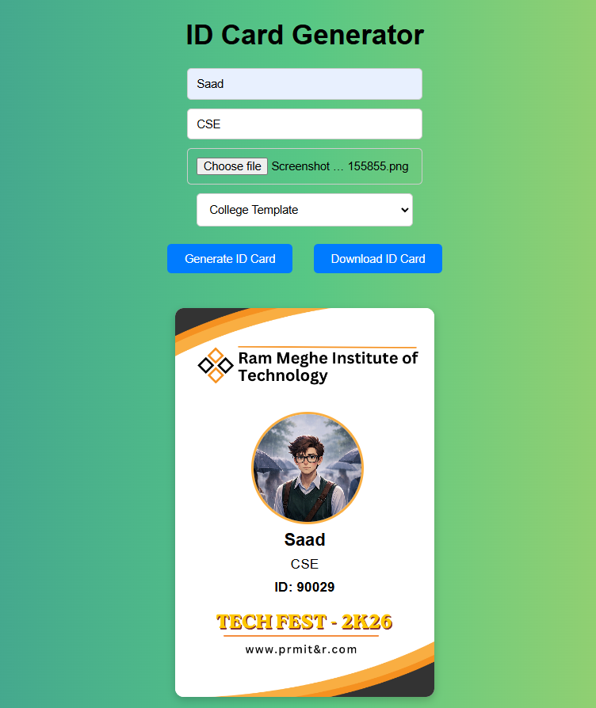

# ID Card Generator 🪪

A simple web application to generate downloadable ID cards for college or company use.
Enter personal details, upload a photo, and instantly get a professional ID card!

---

## 📸 Preview



---

## ✨ Features

- Generate College or Company ID cards
- Upload personal photo
- Enter custom details
- Download the generated ID card instantly

---

## 🛠️ Tech Stack

- HTML5
- CSS3
- JavaScript

---

## 🚀 How to Run Locally

1. Clone the repository
```bash
git clone https://github.com/apatheticdev-saad/id-card-generator.git
```
2. Open the project folder
3. Open `index.html` in your browser — that's it!

---

## 👤 Author

**Saad**
- GitHub: [@apatheticdev-saad](https://github.com/apatheticdev-saad)